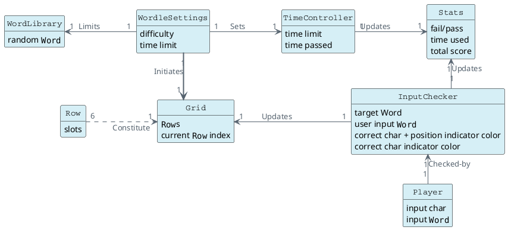
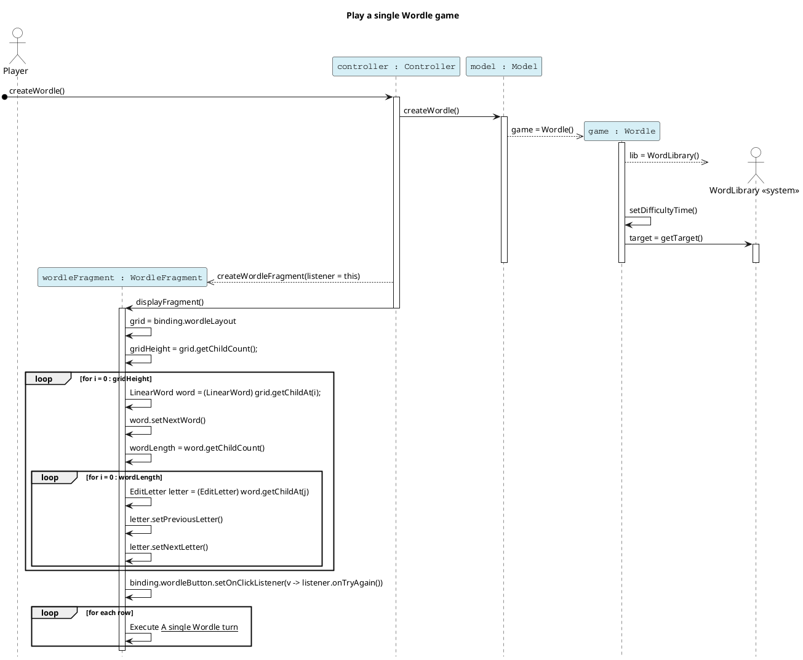
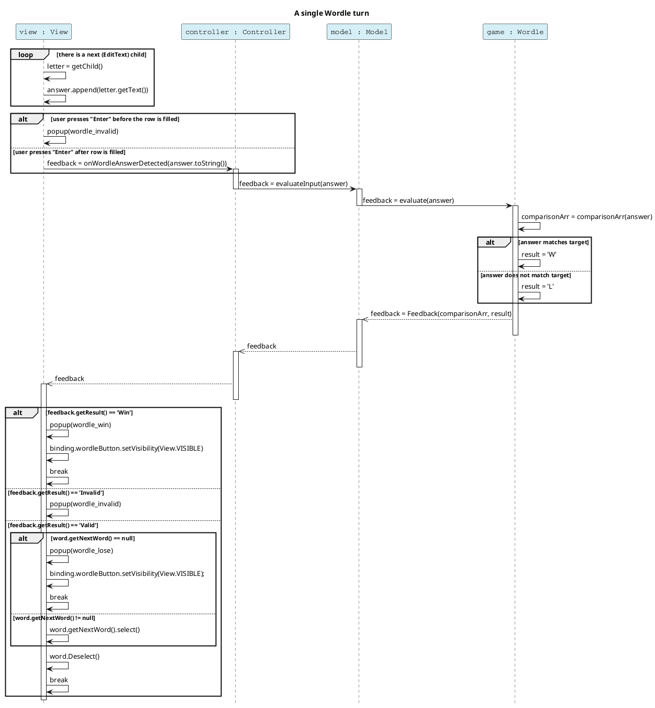
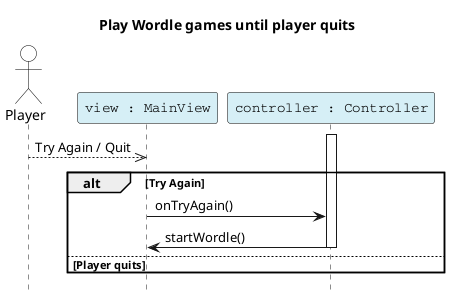
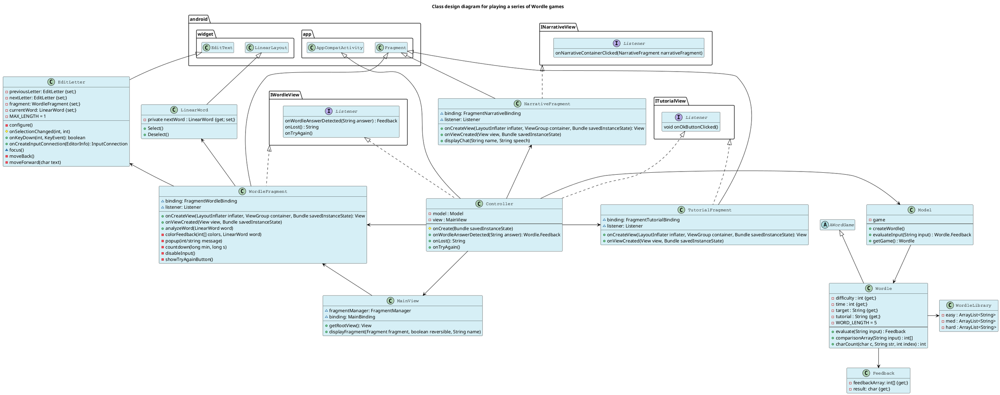

# Wordle Design

## Design diagrams for playing a single game of Wordle

### Domain Model

```plantuml
@startuml
hide empty methods
hide circle
skinparam linetype polyline
skinparam linetype ortho
skinparam roundcorner 5
skinparam nodesep 120
skinparam ranksep 50
skinparam class {
    FontName Courier
    BackgroundColor #d6eff6
    BorderColor black
}
skinparam sequence {
    ArrowColor #55626e
    ArrowFontColor #55626e
}

'classes
class WordleSettings {
    difficulty
    time limit
}
class TimeController {
    time limit
    time passed
}
class WordLibrary {
    random ""Word""
}
class Grid {
    ""Row""s
    current ""Row"" index
}
class Row {
    slots
}
class Player {
    input char
    input ""Word""
}
class InputChecker {
    target Word
    user input ""Word""
    correct char + position indicator color
    correct char indicator color
}
class Stats {
    fail/pass
    time used
    total score
}

'associations
WordleSettings "1" -right-> "1" TimeController : Sets
WordleSettings "1" -left-> "1" WordLibrary : Limits
WordleSettings "1" -down[bold]-> "1" Grid : Initiates
Row "6" -right[dashed]-> "1" Grid : Constitute
Player "1" -up-> "1" InputChecker : Checked-by
TimeController "1" -right-> "1" Stats : Updates
InputChecker "1" -left-> "1" Grid : Updates
InputChecker "1" -up-> "1" Stats : Updates
@enduml
```
### Sequence Diagrams

```plantuml
@startuml
title Play a single Wordle game
hide footbox
skinparam participant {
    FontName Courier
    BackgroundColor #d6eff6
    BorderColor black
}

skinparam actor {
    BackgroundColor white
    BorderColor black
}

' human actors
actor Player as player

' system components
participant "wordleFragment : WordleFragment" as view
participant "controller : Controller" as controller
participant "model : Model" as model
participant "game : Wordle" as game

' non-human actors
actor "WordLibrary <<system>>" as lib

[o-> controller : createWordle()
activate controller

controller -> model : createWordle()
activate model

model -->> game **: game = Wordle()
activate game

game -->> lib **: lib = WordLibrary()

game -> game : setDifficultyTime()

game -> lib : target = getTarget()
activate lib
deactivate lib
deactivate game
deactivate model

controller -->> view **: createWordleFragment(listener = this)
controller -> view : displayFragment()
deactivate controller
activate view

view -> view : grid = binding.wordleLayout
view -> view : gridHeight = grid.getChildCount();
loop for i = 0 : gridHeight
view -> view : LinearWord word = (LinearWord) grid.getChildAt(i);
view -> view : word.setNextWord()
view -> view : wordLength = word.getChildCount()
loop for i = 0 : wordLength
view -> view : EditLetter letter = (EditLetter) word.getChildAt(j)
view -> view : letter.setPreviousLetter()
view -> view : letter.setNextLetter()
end
end
view -> view : binding.wordleButton.setOnClickListener(v -> listener.onTryAgain())


loop for each row
view -> view : Execute __A single Wordle turn__
end
deactivate view

@enduml
```

```plantuml
@startuml
title A single Wordle turn
hide footbox
skinparam participant {
    FontName Courier
    BackgroundColor #d6eff6
    BorderColor black
}

skinparam actor {
    BackgroundColor white
    BorderColor black
}

' system components
participant "view : View" as view
participant "controller : Controller" as controller
participant "model : Model" as model
participant "game : Wordle" as game


loop there is a next (EditText) child
view -> view : letter = getChild()
view -> view : answer.append(letter.getText())
end
alt user presses "Enter" before the row is filled
view -> view : popup(wordle_invalid)
else user presses "Enter" after row is filled
view -> controller : feedback = onWordleAnswerDetected(answer.toString())
activate controller
end
deactivate view
controller -> model : feedback = evaluateInput(answer)
deactivate controller
activate model
model -> game : feedback = evaluate(answer)
deactivate model
activate game
game -> game : comparisonArr = comparisonArr(answer)
alt answer matches target
game -> game : result = 'W'
else answer does not match target
game -> game : result = 'L'
end
game -->> model : feedback = Feedback(comparisonArr, result)
activate model
deactivate game
model -->> controller : feedback
activate controller
deactivate model
controller -->> view : feedback
activate view
deactivate controller
alt feedback.getResult() == 'Win'
view -> view : popup(wordle_win)
view -> view : binding.wordleButton.setVisibility(View.VISIBLE)
view -> view : break
else feedback.getResult() == 'Invalid'
view -> view : popup(wordle_invalid)
else feedback.getResult() == 'Valid'
alt word.getNextWord() == null
view -> view : popup(wordle_lose)
view -> view : binding.wordleButton.setVisibility(View.VISIBLE);
view -> view : break
else word.getNextWord() != null
view -> view : word.getNextWord().select()
end
view -> view : word.Deselect()
view -> view : break
end
deactivate view
@enduml
```

```plantuml
@startuml
hide footbox
title Play Wordle games until player quits

skinparam participant {
    FontName Courier
    BackgroundColor #d6eff6
    BorderColor black
}

skinparam actor {
    BackgroundColor white
    BorderColor black
}

' human actors
actor Player as player

' system components
participant "view : MainView" as view
participant "controller : Controller" as controller
activate controller
player -->> view : Try Again / Quit
alt Try Again
view -> controller: onTryAgain()
controller -> view : startWordle()
else Player quits
deactivate controller
end
@enduml
```

### Class Diagram

```plantuml
@startuml
title Class design diagram for playing a series of Wordle games

'skinparam classAttributeIconSize 0 
skinparam class {
    FontName Courier
    BackgroundColor #d6eff6
    BorderColor black
}
skinparam ArrowColor black

hide empty method
hide empty field

class MainView {
~fragmentManager: FragmentManager
~binding: MainBinding
+ getRootView(): View
+ displayFragment(Fragment fragment, boolean reversible, String name)
}

class Controller extends android.app.AppCompatActivity implements IWordleView.Listener, ITutorialView.Listener{
    -model : Model
    -view : MainView
    --
#onCreate(Bundle savedInstanceState)
+onWordleAnswerDetected(String answer): Wordle.Feedback
+onLost(): String
+onTryAgain()
}

class Model {
    -game
    --
    +createWordle()
    +evaluateInput(String input) : Wordle.Feedback
+getGame() : Wordle
}

class Wordle {
    -difficulty : int {get;}
    -time : int {get;}
    -target : String {get;}
 -tutorial : String {get;}
    -WORD_LENGTH = 5
    --
    +evaluate(String input) : Feedback
    +comparisonArray(String input) : int[]
    +charCount(char c, String str, int index) : int
}

class Feedback{
- feedbackArray: int[] {get;}
- result: char {get;}
}

class WordleLibrary{
-easy : ArrayList<String>
-med : ArrayList<String>
-hard : ArrayList<String>
}

interface IWordleView.Listener{
onWordleAnswerDetected(String answer) : Feedback
onLost() : String
onTryAgain()
}

interface ITutorialView.Listener{
void onOkButtonClicked()
}

interface INarrativeView.Listener{
onNarrativeContainerClicked(NarrativeFragment narrativeFragment)
}

class WordleFragment extends android.app.Fragment implements IWordleView{
~binding: FragmentWordleBinding
    ~listener: Listener
    +onCreateView(LayoutInflater inflater, ViewGroup container, Bundle savedInstanceState): View 
    +onViewCreated(View view, Bundle savedInstanceState)
    +analyzeWord(LinearWord word)
    -colorFeedback(int[] colors, LinearWord word)
    -popup(int/string message)
    -countdown(long min, long s)
    -disableInput()
    -showTryAgainButton()
}

class TutorialFragment extends android.app.Fragment implements ITutorialView{
~binding: FragmentTutorialBinding
    ~listener: Listener
    +onCreateView(LayoutInflater inflater, ViewGroup container, Bundle savedInstanceState): View 
    +onViewCreated(View view, Bundle savedInstanceState)
}

class NarrativeFragment extends android.app.Fragment implements INarrativeView{
~binding: FragmentNarrativeBinding
    ~listener: Listener
    +onCreateView(LayoutInflater inflater, ViewGroup container, Bundle savedInstanceState): View 
    +onViewCreated(View view, Bundle savedInstanceState)
    +displayChat(String name, String speech)
}


class LinearWord extends android.widget.LinearLayout {
- private nextWord : LinearWord {get; set;}
+ Select()
+ Deselect()
}

class EditLetter extends android.widget.EditText{
    - previousLetter: EditLetter {set;}
    - nextLetter: EditLetter {set;}
    - fragment: WordleFragment {set;}
    - currentWord: LinearWord {set;}
- MAX_LENGTH = 1
    - configure()
    # onSelectionChanged(int, int)
    + onKeyDown(int, KeyEvent): boolean
    + onCreateInputConnection(EditorInfo): InputConnection
    ~ focus()
- moveBack()
- moveForward(char text)
}

abstract class AWordGame {
}

Controller -> Model
Controller -down-> MainView
Controller -left-> WordleFragment
Controller -right-> TutorialFragment
Controller -up-> NarrativeFragment
MainView -> WordleFragment
WordleFragment -left-> EditLetter
WordleFragment -up-> LinearWord
AWordGame <|-- Wordle
Model -down-> Wordle
Wordle -down-> Feedback
Wordle -right-> WordleLibrary

@enduml
```
